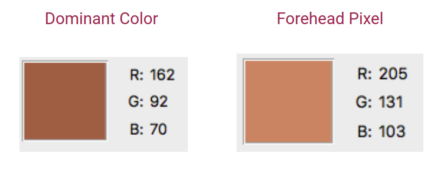
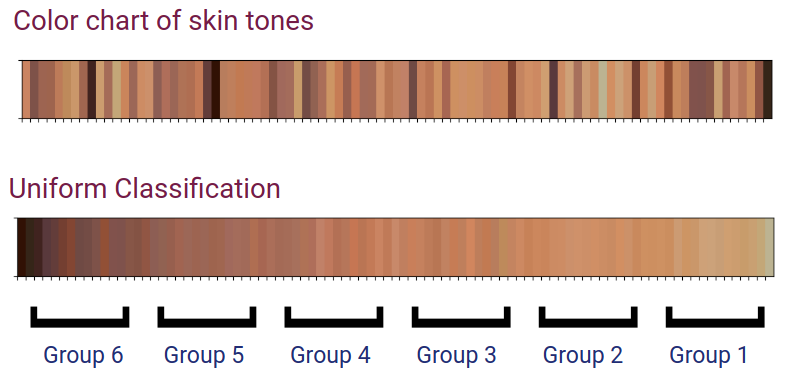
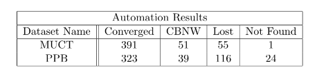

# Towards More Inclusive Facial Detection

## Abstract
WebGazer uses computer webcams to track eye-gaze locations of users in real time. This eye-tracking library is solely implemented in JavaScript and can be easily integrated within a web browser. WebGazer uses a model implemented by another JavaScript library, clmtrackr to fit facial models on faces tracked through video. This library allows WebGazer to train models that map eye features and their relative position on the screen.

Currently, WebGazer fails to accurately track people with beards, people wearing glasses, or people with dark skin. With the training image set for one of the face detection modules integrated within WebGazer being one of the most diverse available, it is crucial to understand why it still continues to fail. In order for WebGazer to be as accurate as possible, it is crucial for this face detection module, clmtrackr to be as inclusive as possible and work for a wide variety of faces.

Learning extensively how the external face detection tracker module clmtrackr, included by default in WebGazer, works is the best way to improve how facial features are tracked while the script runs and help determine external factors that inhibit WebGazer from achieving its full potential.

## Methodology
The goal of determining why clmtrackr fails to track certain faces started with analyzing the dataset used to train it. The color analysis described in the methods of this paper began with the MUCT dataset. Several Python scripts were coded for different tasks in this analysis. The first Python script was created to crop the images and extract the foreheads in each photo in the MUCT and PPB datasets while another script was created to sort the colors obtained from the images. Once each script was tested and correctness was guaranteed, both of these scripts were combined into one. From the combined script, a copy was created for the MUCT dataset and another copy the PPB dataset. Since the datasets were contained in different directories on the author’s computer, the separate scripts helped to keep the enormous amounts of images organized. This
increased the efficiency of the computational pipeline created to analyze the MUCT and PPB datasets and helped streamline the process of extracting and analyzing skin tone colors from the images in each respective dataset.

## Results
The lack of consistency in pose, lighting, and image size within the PPB dataset may have contributed to the disparity between the results of the “Not Found” folders from both datasets. Although the sample size is small, a clear trend is noticed in images with subjects of darker skin-tone colors less likely to be successfully recognized.

### Forehead color extraction
To anaylze which skintones were more likely to not be detected in face tracking libraries, the skintones from each image in the dataset were extracted. At first, the average color from the photo was chosen, but found to be inaccurate. A method was derived to extract skintone color from the centermost part of a subject's forehead since it was more likely to be consistent with a subject's true skintone color.



### Color analysis
Once the skintone colors were extracted from images within the dataset, they were sorted into six categories based on the six Fitzpatrick skin types through a uniform classification.



### Face detection automation 
Automation was run on 500 images from each dataset to determine how well faces from the MUCT and PPB datasets could be detected.




## Datasets
The datasets used in this work are [MUCT](http://www.milbo.org/muct/) and Pilot Parliaments Benchmark (PPB). You can request access to the Pilot Parliaments Benchmark Dataset (for non-commercial use only) from the [Algorithmic Justice League](https://www.ajlunited.org/connect/request-dataset-for-research).

## Project Presentation
The project presentation can be found [here](https://docs.google.com/presentation/d/e/2PACX-1vQYkkshsEJSTDI2gJ0n2nbzFXtnoE_PbInYXVWYsq4oXIYgbrI8vxgUHqg53ANup9-KveUmWr1w8g5t/pub?start=false&loop=false&delayms=3000&slide=id.p).

## Citation

Okolo, C. T. 2018. ‘Towards More Inclusive Facial Detection’, Senior Project, Pomona College, Claremont, California, USA.

```
@misc{okolo_2018, 
          title = {Towards More Inclusive Facial Detection},
          author={Okolo, Chinasa T},
          year={2018}}
```
